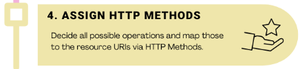

   
//code  
  
/user
/user/wishlists  
/user/wishlist/id  
/user/wishlist//id/delete  
/user/wishlist/id/update  
/user/wishlist/create  
/user/wishlist/id/additem  
/user/wishlist/id/item/id/delete  
/user/wishlist/id/item/id/update  
  
//code  
  
//code  